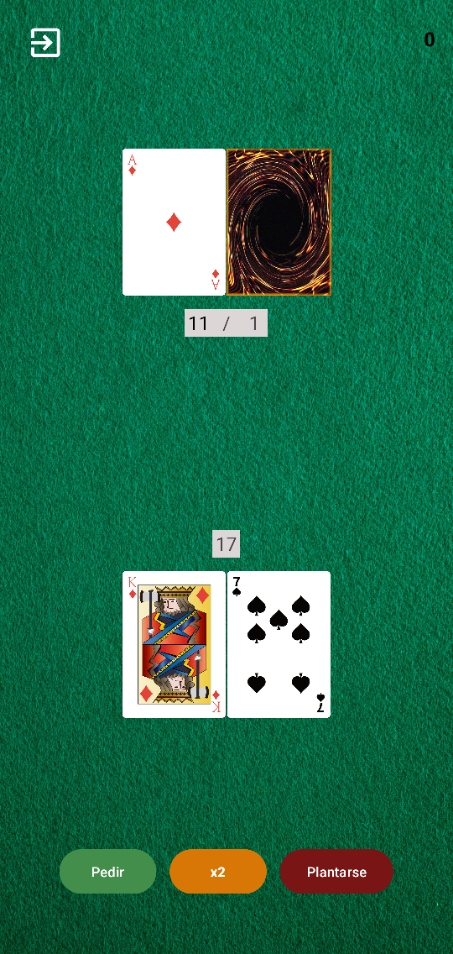
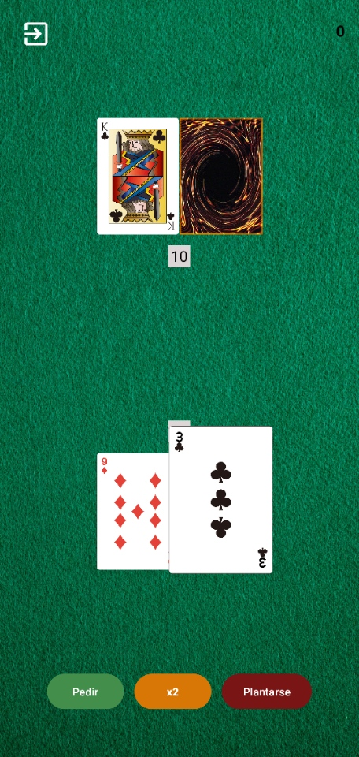
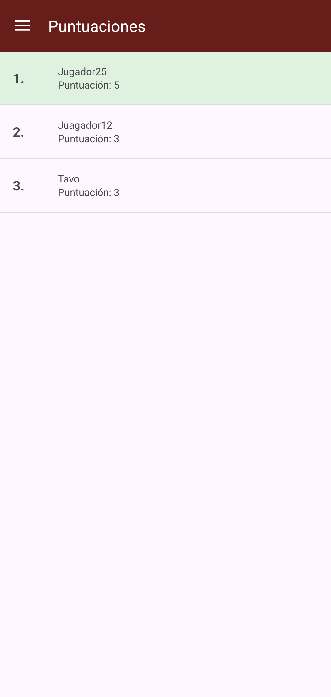

# Blackjack

Aplicación Android desarrollada como proyecto universitario.

> **Aviso:** este proyecto tiene fines educativos y prácticos. No representa un juego de apuestas con dinero real ni está pensado para un entorno de producción.

## Descripción

La aplicación es un juego de blackjack para Android que permite jugar partidas contra la banca, calcular puntuaciones automáticamente, realizar jugadas como doblar (x2) y consultar récords de manera local o mediante un ranking online opcional.

## Capturas de pantalla

<table align="center">
  <tr>
    <td align="center">
      <br>
      <em>Imagen 1. Menú principal</em>
    </td>
    <td align="center">
      <br>
      <em>Imagen 2. Mesa de juego</em>
    </td>
  </tr>
  <tr>
    <td align="center">
      <br>
      <em>Imagen 3. Inspección táctil y botón x2</em>
    </td>
    <td align="center">
      <br>
      <em>Imagen 4. Tabla de puntuaciones</em>
    </td>
  </tr>
</table>

## Características

Incluye funciones para:

- Partidas de blackjack clásico contra la banca con baraja de 52 cartas.
- Cálculo dinámico del valor del As (1 u 11) y detección de blackjack natural, victorias, derrotas y empates.
- Opción de Doblar (x2) en las 2 primeras cartas para recibir una sola carta y ganar 2 puntos en caso de victoria.
- Animaciones de cartas:
  - Reparto y deslizamiento suave de cartas.
  - Re-centrado automático de las cartas en el tapete al recibir nuevas cartas.
  - Apilado en cascada cuando hay muchas cartas en la mano.
  - Inspección táctil con rebote (Bounce y Zoom) al presionar cualquier carta para verla en tamaño completo.
- Guardado local de puntuaciones y partidas no finalizadas con SharedPreferences.
- Reanudación de partidas en curso desde el menú principal.
- Registro de récords con nombre de usuario.
- Ranking global opcional mediante Firebase Firestore y autenticación anónima.
- Sincronización automática de récords pendientes al recuperar la conexión a Internet.
- Notificaciones Toast en pantalla al registrar nuevos récords o detectar problemas de red.
- Modo offline 100% funcional sin necesidad de configurar servicios externos.

## Tecnologías

- Kotlin.
- Android Studio.
- AndroidX y Material Components.
- View Binding y Navigation Component.
- SharedPreferences local.
- Firebase Authentication y Cloud Firestore.
- OkHttp.
- JUnit 4.

## Reglas principales

- Las cartas numéricas (2-10) conservan su valor nominal.
- J, Q y K valen 10.
- El As vale 11 siempre que no supere los 21 puntos; de lo contrario vale 1.
- La banca roba cartas mientras su puntuación sea menor a 17 y se planta con 17 o más.
- Un blackjack natural se forma con las dos primeras cartas y suma 21.
- Al pulsar x2 (Doblar), el jugador recibe únicamente 1 carta y su turno finaliza automáticamente.

## Requisitos

- Android Studio.
- JDK 11, 17 o 21.
- Android SDK 34 o superior.
- Dispositivo físico o emulador con Android 10 (API 29) o superior.

## Ejecución del proyecto

1. Clona el repositorio:
   ```bash
   git clone https://github.com/wTavo/Blackjack.git
   ```
2. Abre la carpeta del proyecto en Android Studio.
3. Espera a que Gradle sincronice las dependencias.
4. Ejecuta la aplicación en un dispositivo o emulador.

El juego funciona directamente en modo offline sin requerir ninguna configuración de Firebase.

## Firebase opcional

Firebase solo se utiliza para sincronizar el ranking global de puntuaciones:

1. Crea un proyecto en [Firebase Console](https://console.firebase.google.com/).
2. Registra una aplicación Android con el paquete `com.example.blackjack`.
3. Habilita Authentication con el proveedor anónimo.
4. Crea una base de datos Cloud Firestore.
5. Descarga el archivo `google-services.json` y colócalo en `app/google-services.json`.

*(Consulta `FIREBASE_SETUP.md` y `app/google-services.json.example` como referencia).*

## Pruebas y compilación

En Windows se pueden ejecutar las pruebas unitarias con:

```powershell
./gradlew.bat testDebugUnitTest
```

Para generar el APK de depuración:

```powershell
./gradlew.bat assembleDebug
```

## Estructura del proyecto

```text
app/src/main/java/com/example/blackjack/
├── CheckConnection.kt           # Comprobación de conexión y acceso offline
├── FirebaseAvailability.kt      # Detección y autenticación con Firebase
├── Game.kt                      # Controlador y ciclo de vida de la partida
├── PlayerProfile.kt             # Validación y lógica del perfil de jugador
├── RecordPolicy.kt              # Reglas para registrar y comparar récords
├── RoomMain.kt                  # Menú principal y barra de navegación
├── SavedGameStore.kt            # Guardado y persistencia en SharedPreferences
├── Score.kt                     # Modelo de datos para las puntuaciones
├── adapterPuntuaciones.kt       # Adaptador para la lista del ranking
│
├── data/
│   └── ScoreSyncManager.kt      # Sincronización asíncrona de récords y Firestore
│
├── game/
│   ├── Card.kt                  # Modelos de cartas, palos y valores
│   ├── CardResources.kt         # Mapeo de cartas con recursos gráficos Drawables
│   ├── Deck.kt                  # Baraja estándar de 52 cartas y reparto
│   ├── GameRules.kt             # Reglas de victoria, derrota y empate
│   ├── HandScorer.kt            # Cálculo y evaluación de manos
│   └── SavedGameState.kt        # Modelo y serialización del estado de partida
│
└── ui/
    ├── GameCardPresenter.kt     # Renderizado y animaciones de cartas
    ├── GameDialogHelper.kt      # Diálogos modales y mensajes emergentes
    ├── gallery/
    │   ├── GalleryFragment.kt   # Pantalla de visualización del ranking
    │   └── GalleryViewModel.kt  # ViewModel para el fragmento de ranking
    ├── home/
    │   ├── HomeFragment.kt      # Pantalla principal del menú
    │   └── HomeViewModel.kt     # ViewModel para el fragmento de inicio
    └── slideshow/
        ├── SlideshowFragment.kt # Pantalla de información y configuración
        └── SlideshowViewModel.kt# ViewModel para el fragmento de información
```